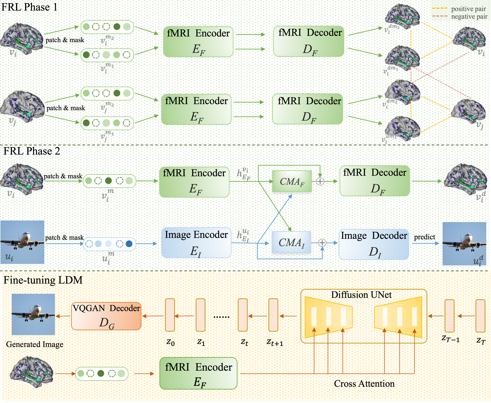

# Contrast, Attend and Diffuse to Decode High-Resolution Images from Brain Activities

[Jingyuan Sun*](https://sites.google.com/view/jingyuan-sun/home?authuser=0), [Mingxiao Li*](https://github.com/Mingxiao-Li), Zijiao Chen, Yunhao Zhang, Shaonan Wang and Marie-Francine Moens. In Proceedings of the Neural Information Processing Systems 2023 (NeurIPS'23).

[](https://paperswithcode.com/sota/brain-visual-reconstruction-from-fmri-on-god?p=contrast-attend-and-diffuse-to-decode-high)

## 1. Abstract
Decoding visual stimuli from neural responses recorded by functional Magnetic Resonance Imaging (fMRI) presents an intriguing intersection between cognitive neuroscience and machine learning, promising advancements in understanding human visual perception. However, the task is challenging due to the noisy nature of fMRI signals and the intricate pattern of brain visual representations. To mitigate these challenges, we introduce a two-phase fMRI representation learning framework. The first phase pre-trains an fMRI feature learner with a proposed Double-contrastive Mask Auto-encoder to learn denoised representations. The second phase tunes the feature learner to attend to neural activation patterns most informative for visual reconstruction with guidance from an image auto-encoder. The optimized fMRI feature learner then conditions a latent diffusion model to reconstruct image stimuli from brain activities. Experimental results demonstrate our model's superiority in generating high-resolution and semantically accurate images, substantially exceeding previous state-of-the-art methods by $39.34\%$ in the 50-way-top-1 semantic classification accuracy. The code implementations will be available at 


## 2. Method Overview

We propose a double-phase fMRI representation learning framework. In Phase 1, we pre-train an MAE with a contrastive loss to learn fMRI representations from unlabeled data. After pre-training in Phase 1, we tune the fMRI auto-encoder with an image auto-encoder.  After FRL Phase 1 and Phase 2, we apply the representation learned by the fMRI auto-encoder as conditions to tune the LDM and generate the image from the brain activities. 

## 3. Training Procedure

### 3.0 Setting Environments

Create and activate conda environment named ```vis_dec``` from this ```env.yaml```
```sh
conda env create -f env.yaml
conda activate vis_dec
```


### 3.1 FRL Phase 1
#### Overview
In Phase 1, we pre-train an MAE with a contrastive loss to learn fMRI representations from unlabeled fMRI data from HCP. The masking which sets a certain portion of the input data to zero targets the spatial redundancy of fMRI data. The calculation of recovering the original data from the remaining after masking suppresses noises. Optimization of the contrastive loss discerns common patterns of brain activities over individual variances.
#### Preparing Data 
In this phase, we use fMRI samples released by HCP as pretraining data. Due to size limitations and licensing constraints, please download from the official website (https://db.humanconnectome.org/data/projects/HCP_1200), put them in the ./data/HCP directory and preprocess the data with ./data/HCP/preprocess_hcp.py. Resulting data and directory looks like:
```
/data
┣ 📂 HCP
┃   ┣ 📂 npz
┃   ┃   ┣ 📂 dummy_sub_01
┃   ┃   ┃   ┗ HCP_visual_voxel.npz
┃   ┃   ┣ 📂 dummy_sub_02
┃   ┃   ┃   ┗ ...
```
#### Training Model

You can run
```
python -m torch.distributed.launch —nproc_per_node=1  code/phase1_pretrain_contrast.py \
--output_path . \  
--contrast_loss_weight 1 \
—-batch_size 250 \
—-do_self_contrast True \
—-do_cross_contrast True \
--self_contrast_loss_weight 1 \ 
--cross_contrast_loss_weight 0.5 \
—mask_ratio 0.75 \
—num_epoch 140 
```
to pretrain the model by youself.
do_self_contrast and do_contrast_contrast control whether or not self_contrast and contrast_contrast loss are used.
self_contrast_loss_weight and cross_contrast_loss_weight denote the weight of self-contrast and cross-contrast loss in the joint loss.

You can also download our pretrained ckpt from https://1drv.ms/u/s!AlmPyF18ti-A3XmuKMPEfVNdvmsT?e=ROrzfE
### 3.2 FRL Phase 2

#### Overview 
After pre-training in Phase 1, we tune the fMRI auto-encoder with an image auto-encoder. We expect the pixel-level guidance from the image auto-encoder to support the fMRI auto-encoder in disentangling and attending to brain signals related to vision processing. 

#### Preparing Data
We use the Generic Object Decoding (GOD) and BOLD5000 dataset in this phase. GOD is a specialized resource developed for fMRI-based decoding. It aggregates fMRI data gathered through the presentation of images from 200 representative object categories, originating from the 2011 fall release of ImageNet. The training session incorporated 1,200 images (8 per category from 150 distinct object categories). The test session included 50 images (one from each of the 50 object categories). The categories in the test session were unique from those in the training session and were introduced in a randomized sequence across runs. On five subjects the fMRI scanning was conducted. BOLD5000   is a result of an extensive slow event-related human brain fMRI study. It comprises 5,254 images, with 4,916 of them being unique.  The images in BOLD5000 were selected from three popular computer vision datasets: ImageNet, COCO, and Scenes.  

We provided processed versions of these datasets which can be downloaded from https://1drv.ms/u/s!AlmPyF18ti-A3Xec-3-PdsaO230u?e=uL35tO. 
Please download and uncompress it into the ./data. Resulting directory looks like:

```

┣ 📂 Kamitani
┃   ┣ 📂 npz
┃   ┃   ┗ 📜 sbj_1.npz
┃   ┃   ┗ 📜 sbj_2.npz
┃   ┃   ┗ 📜 sbj_3.npz
┃   ┃   ┗ 📜 sbj_4.npz
┃   ┃   ┗ 📜 sbj_5.npz
┃   ┃   ┗ 📜 images_256.npz
┃   ┃   ┗ 📜 imagenet_class_index.json
┃   ┃   ┗ 📜 imagenet_training_label.csv
┃   ┃   ┗ 📜 imagenet_testing_label.csv

┣ 📂 BOLD5000
┃   ┣ 📂 BOLD5000_GLMsingle_ROI_betas
┃   ┃   ┣ 📂 py
┃   ┃   ┃   ┗ CSI1_GLMbetas-TYPED-FITHRF-GLMDENOISE-RR_allses_LHEarlyVis.npy
┃   ┃   ┃   ┗ ...
┃   ┃   ┃   ┗ CSIx_GLMbetas-TYPED-FITHRF-GLMDENOISE-RR_allses_xx.npy
┃   ┣ 📂 BOLD5000_Stimuli
┃   ┃   ┣ 📂 Image_Labels
┃   ┃   ┣ 📂 Scene_Stimuli
┃   ┃   ┣ 📂 Stimuli_Presentation_Lists

```

#### Training Model

You can run the following commands to get the fMRI encoder that we use to produce the reported reconstruction performance on GOD subject 3 in the paper.

```
python -m torch.distributed.launch --nproc_per_node=4 code/phase2_finetune_cross.py \
--dataset GOD \
--pretrain_mbm_path your_pretrained_ckpt_from_phase1 \
--batch_size 4 \
--num_epoch 60 \
--fmri_decoder_layers 6 \
--img_decoder_layers 6 \
--fmri_recon_weight 0.25 \ 
--img_recon_weight 1.5 \
--output_path your_output_path \ 
--img_mask_ratio 0.5 \
--mask_ratio 0.75 
```
You can also download our trained ckpt from https://1drv.ms/u/s!AlmPyF18ti-A3XjJEkOfBELTl71W?e=FbsYki

### 3.3 Tuning LDM
#### Overview

#### Tuning Model

You can run the following commands to produce the reported reconstruction performance on GOD subject 3 in the paper.
```
python code/ldm_finetune.py --pretrain_mbm_path your_phase2_ckpt_path \
--num_epoch 700 \
--batch_size 8 \
--is_cross_mae \
--dataset GOD \
--kam_subs sbj_3 \
--target_sub_train_proportion 1. 
--lr 5.3e-5
```


## Acknowledgements
A large part of the code is inheritated from our previous work [Mind-Vis](https://github.com/zjc062/mind-vis) . 
We express our gratitude to the following entities for generously sharing their raw and pre-processed data with the public: [Kamitani Lab](https://github.com/KamitaniLab), [Weizmann Vision Lab](https://github.com/WeizmannVision), and the [BOLD5000 team](https://bold5000-dataset.github.io/website/). Our implementation of Masked Brain Modeling is built upon [Masked Autoencoders](https://github.com/facebookresearch/mae) by Facebook Research, and our Conditional Latent Diffusion Model implementation is based on the work found in the [Latent Diffusion Model](https://github.com/CompVis/latent-diffusion) repository from CompVis. We extend our appreciation to these authors for openly sharing their code and checkpoints.

## Citation
Please cite our paper if the code should be useful for you.
```
@inproceedings{
sun2023contrast,
title={Contrast, Attend and Diffuse to Decode High-Resolution Images from Brain Activities},
author={Jingyuan Sun and Mingxiao Li and Yunhao Zhang and Marie-Francine Moens and Zijiao Chen and Shaonan Wang},
booktitle={Thirty-seventh Conference on Neural Information Processing Systems},
year={2023},
url={https://openreview.net/forum?id=YZSLDEE0mw}
}
```

